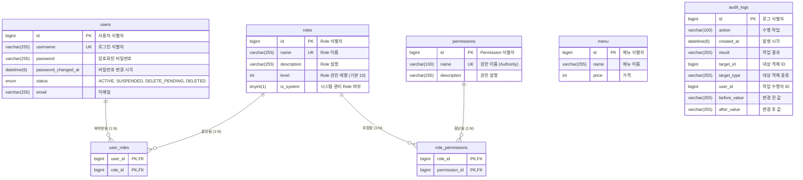

---

# 1. RBAC Database ERD (Entity-Relationship Diagram)

현재 구동 중인 APMS.SR 시스템의 사용자, 역할, 권한, 감사 로그의 데이터베이스 구조와 관계를 시각화한 ERD입니다.

---

# 2. RBAC 기반 API 명세서 (API Specification)

제공된 14개의 Permission(Authority)을 기준으로 도출한 핵심 도메인별 API 엔드포인트 명세입니다.
모든 API는 요청 사용자의 `Role` 이름이 아닌, **부여된 `Permission (Authority)` 보유 여부를 기준**으로 인가(`@PreAuthorize`)됩니다.

## 2.1 User Domain (사용자 관리)

| Method | Endpoint | 역할 및 기능 | 필요 권한 (Authority) |
| --- | --- | --- | --- |
| `GET` | `/api/users` | 사용자 목록 및 상세 조회 | `USER_READ` |
| `PATCH` | `/api/users/{id}/status` | 사용자 상태 변경 (ACTIVE ↔ SUSPENDED 등) | `USER_STATUS_UPDATE` |
| `DELETE` | `/api/users/{id}` | 사용자 삭제 (Soft Delete ↔ DELETED) | `USER_DELETE` |
| `PUT` | `/api/users/{id}/roles` | 특정 사용자에게 Role 부여 및 해제 | `USER_ROLE_MANAGE` |

> **Audit Log 연동:** 상태 변경(`USER_STATUS_UPDATE`), 삭제(`USER_DELETE`), 권한 부여(`USER_ROLE_MANAGE`) API 호출 시 `audit_logs`에 이력이 자동 기록됩니다.

## 2.2 Role Domain (역할 관리)

| Method | Endpoint | 역할 및 기능 | 필요 권한 (Authority) |
| --- | --- | --- | --- |
| `GET` | `/api/roles` | Role 목록 및 상세 정보 조회 | `ROLE_READ` |
| `POST` | `/api/roles` | 신규 Role 생성 | `ROLE_CREATE` |
| `PUT` | `/api/roles/{id}` | 기존 Role 정보(이름, 설명 등) 수정 | `ROLE_UPDATE` |
| `DELETE` | `/api/roles/{id}` | Role 삭제 | `ROLE_DELETE` |
| `PUT` | `/api/roles/{id}/permissions` | 특정 Role에 Permission 연결 및 해제 | `ROLE_ASSIGN` |

> **Audit Log 연동:** Role 생성(`ROLE_CREATE`) 및 Permission 할당(`ROLE_ASSIGN`) 로직 수행 시 감사 로그가 기록됩니다.

## 2.3 Permission Domain (권한 관리)

| Method | Endpoint | 역할 및 기능 | 필요 권한 (Authority) |
| --- | --- | --- | --- |
| `GET` | `/api/permissions` | 시스템에 등록된 14개 전체 Permission 목록 조회 | `PERMISSION_READ` |

> *참고:* Permission 자체는 시스템의 코드 레벨 정책과 강하게 결합되어 있으므로 현재 CREATE, UPDATE, DELETE API는 존재하지 않으며 조회 기능만 제공합니다.

## 2.4 Menu Domain (메뉴 관리)

| Method | Endpoint | 역할 및 기능 | 필요 권한 (Authority) |
| --- | --- | --- | --- |
| `GET` | `/api/menus` | 메뉴 목록 및 가격 조회 | `MENU_READ` |
| `POST` | `/api/menus` | 신규 메뉴 등록 | `MENU_CREATE` |
| `PUT` | `/api/menus/{id}` | 기존 메뉴 정보 수정 | `MENU_UPDATE` |
| `DELETE` | `/api/menus/{id}` | 특정 메뉴 데이터 삭제 | `MENU_DELETE` |

## 2.5 Audit Log Domain (감사 로그 - 시스템 추적)

*(※ 문서 상 명시적인 로그 조회 Permission은 선언되어 있지 않으나, 관리자 기능이 존재함을 가정하여 도출한 API입니다.)*

| Method | Endpoint | 역할 및 기능 | 필요 권한 (Authority) |
| --- | --- | --- | --- |
| `GET` | `/api/audit-logs` | 시스템 주요 행위(상태 변경, 권한 할당 등) 이력 조회 | `ADMIN` (또는 신규 조회 권한 필요) |

