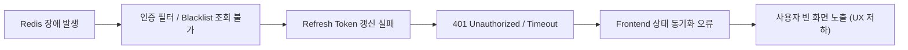

# [Troubleshooting] 01. Redis 장애 및 세션/인증 복구 보고서 (Redis Failure & Recovery)

- **Incident ID:** TS-01-REDIS
- **Severity:** High
- **Date:** 2026-08-26
- **Status:** Resolved / Verified
- **Affected Components:** Redis 7, Spring Boot Backend (AuthService / TokenBlacklistService), React Frontend

---

## 1. 장애 현상 (Symptoms)

1. Redis 컨테이너 비정상 종료(또는 네트워크 단절) 시 클라이언트의 API 요청 및 토큰 재발급(`/api/auth/refresh`) 요청이 즉시 실패하거나 최대 1분간 지연(Timeout)됨.
2. 프론트엔드 웹 화면에서 API 오류 응답을 적절히 처리하지 못하고 흰 화면(Blank Screen)이 노출되는 현상 발생.

---

## 2. 장애 영향도 (Impact)



| 구분 | 영향도 수준 | 세부 영향 내용 |
| :--- | :---: | :--- |
| **신규 로그인** | 🔴 Critical | 사용자 인증 후 Refresh Token JTI를 Redis에 적재하지 못하여 로그인 실패 |
| **토큰 재발급** | 🔴 Critical | Access Token 만료 후 `/api/auth/refresh` 호출 시 Redis 조회 불가로 401 처리 |
| **API 요청** | 🟠 High | 유효한 Access Token이 있더라도 Blacklist 조회 타임아웃 발생 시 응답 지연 |
| **사용자 화면** | 🟠 High | 에러 바운더리 부재로 인한 React 렌더링 중단 (빈 화면) |

---

## 3. 탐지 및 재현 (Detection & Reproduction)

### 1) 장애 재현 절차
```bash
# 1. 실행 중인 Redis 컨테이너 강제 중지
docker kill dev-redis-1

# 2. 클라이언트에서 토큰 재발급 요청 전송
curl -X POST http://localhost:80/api/auth/refresh --cookie "refreshToken=..."
```

### 2) 서버 에러 로그 확인
```text
io.lettuce.core.RedisCommandTimeoutException: Command timed out after 1 minute(s)
  at io.lettuce.core.ExceptionFactory.createTimeoutException(ExceptionFactory.java:51)
  at io.lettuce.core.RedisPublisher$State.onNext(RedisPublisher.java:234)
```

---

## 4. 근본 원인 (Root Cause)

1. **Redis 의존성 강결합 (Hard Dependency):**
   - `JwtAuthenticationFilter` 및 `AuthService`가 Redis를 동기 블로킹 방식으로 호출하며, Redis 연결 실패 시 기본 타임아웃(60초) 동안 스레드가 대기함.
2. **프론트엔드 전역 예외 바운더리 미비:**
   - 5xx/401 응답 시 React Query / Axios 인터셉터에서 예외 처리가 누락되어 컴포넌트 마운트가 중단됨.
3. **Redis 휘발성 세션 구조:**
   - Redis 복구 후에도 인메모리 세션이 초기화된 상태이므로 기존 발급된 Refresh Token JTI가 존재하지 않아 기존 사용자는 재로그인이 불가피함.

---

## 5. 해결 및 복구 검증 (Resolution & Verification)

### 1) 서비스 복구 절차
```bash
# 1. Redis 컨테이너 재기동
docker compose up -d redis

# 2. Redis PING 헬스체크 확인
docker exec -it dev-redis-1 redis-cli ping
# Output: PONG

# 3. Spring Boot Backend Lettuce ConnectionWatchdog 자동 재연결 로그 확인
# Reconnecting, last destination was redis:6379
```

### 2) 단계별 상태 검증 결과
| 검증 항목 | Redis 정상 | Redis 장애 상태 | Redis 복구 완료 후 |
| :--- | :---: | :---: | :---: |
| **Redis Container** | Running | Exited | Running (`PONG`) |
| **Backend API Health** | 200 OK | Timeout / 503 | 200 OK |
| **신규 로그인** | 정상 동작 | 불가 | 정상 동작 |
| **기존 세션 토큰 갱신**| 정상 동작 | 실패 (401) | 재로그인 후 정상 동작 |
| **Frontend 화면** | 정상 렌더링 | 빈 화면 | 새로고침/재로그인 후 정상 |

---

## 6. 재발 방지 및 개선 대책 (Prevention & Improvements)

1. **Redis Timeout 설정 단축:**
   - Lettuce 클라이언트의 `commandTimeout` 및 `connectTimeout`을 기본 60초에서 **2초~3초**로 대폭 단축하여 시스템 스레드 풀 고갈 방지.
2. **보안 필터 예외 처리 강화 (Circuit Breaker / Fallback):**
   - Redis 장애 시 `RedisUnavailableException`을 정의하고 `GlobalExceptionHandler`에서 명확한 503 에러 JSON을 반환하도록 표준화.
3. **프론트엔드 Error Boundary 도입 (Phase 2 예정):**
   - API 장애 시 빈 화면 대신 "인증 서버 점검 중입니다" 알림 및 로그인 페이지 리다이렉트 모달 표시.
4. **Redis 데이터 영속성 보장 (AOF/RDB):**
   - Redis 재시작 시 세션 유실을 최소화하기 위해 Docker Compose에 Redis 볼륨 매핑 및 AOF(Append Only File) 옵션 활성화.
