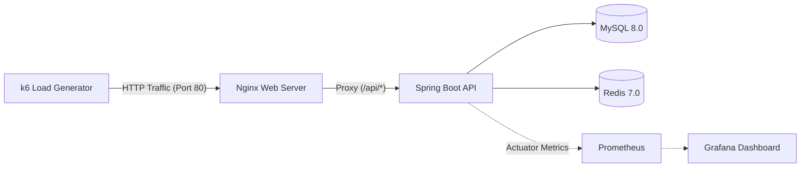

# [Performance] k6 부하 및 스트레스 테스트 보고서 (k6 Load & Stress Test Report)

- **Version:** 1.0.0
- **Last Updated:** 2026-08-26
- **Status:** Active
- **Applied Tech Stack:** k6, Docker Compose, Spring Boot 3.3, Nginx, MySQL 8, Redis 7, Prometheus, Grafana

본 문서는 `APMS.SR` 시스템의 대용량 동시 요청 환경에서의 시스템 처리량(Throughput), 응답 지연시간(Latency), 오류율(Error Rate), 데이터 정합성(Data Integrity)을 검증하기 위한 **k6 부하 테스트 환경**, **테스트 시나리오/조건**, **실행 결과 및 지표 분석**을 통합 기록한 문서입니다.

---

## 1. 부하 테스트 환경 (Test Environment)

### 1) 인프라 및 하드웨어 사양
| 구분 | 사양 및 구성 |
| :--- | :--- |
| **Test Host CPU** | AMD Ryzen 9 PRO 7945 (16 Cores / 32 Threads) |
| **Test Host Memory** | 32GB DDR5 |
| **OS / Platform** | Linux / WSL2 (Ubuntu 22.04 LTS) |
| **Container Runtime**| Docker Engine 24.0+ & Docker Compose v2 |
| **Load Generator** | k6 v0.49+ (Local Container / CLI) |

### 2) 애플리케이션 및 모니터링 스택
| 계층 (Layer) | 적용 기술 | 세부 구성 및 포트 |
| :--- | :--- | :--- |
| **Reverse Proxy** | Nginx | Port 80 (단일 진입점, SPA 서빙 및 API 프록시) |
| **Backend API** | Spring Boot 3.3.2 | Port 8080 (Java 17, JPA, Spring Security) |
| **Database** | MySQL 8.0 | Port 3306 (HikariCP 커넥션 풀) |
| **Cache / Token** | Redis 7.0 | Port 6379 (인메모리 세션/블랙리스트) |
| **Metrics Collector** | Prometheus + VictoriaMetrics | Port 9090 / 8428 (15s 스크랩 주기) |
| **Visualization** | Grafana | Port 3000 (JVM, Nginx, Host 메트릭 표출) |

### 3) 트래픽 및 네트워크 토폴로지

---

## 2. 테스트 시나리오 및 조건 (Test Conditions & Scenarios)

### 1) 비즈니스 흐름 시나리오 (Business Scenarios)
* **User Flow (사용자 흐름 - 20%):**
  - 로그인 ➡️ JWT Access Token 획득 ➡️ 내 정보 조회 (`/api/users/me`) ➡️ 메뉴 조회 (`/api/menus`)
* **Read Flow (조회 전용 흐름 - 70%):**
  - 공개/인증 메뉴 및 기본 카테고리 데이터 반복 조회 (캐싱 및 인덱스 처리량 검증)
* **Admin Flow (관리자 흐름 - 10%):**
  - 관리자 로그인 ➡️ 사용자 목록/상태 조회 ➡️ 신규 메뉴 생성 (`POST /api/admin/menus`) ➡️ 생성된 메뉴 식별 및 조회 ➡️ 메뉴 삭제 (`DELETE /api/admin/menus/{id}`)

### 2) 부하 프로파일 (Load Profile)
| 단계 (Phase) | 동시 가상 사용자 (VU) | 지속 시간 (Duration) | 목적 |
| :--- | :---: | :---: | :--- |
| **Load Test (일반 부하)** | 50 VU | 2분 (2m) | 시스템의 정상 운영 상태에서의 안정적 처리량 및 지연시간 측정 |
| **Stress Test (스트레스 부하)** | 70 VU | 1분 (1m) | 임계 동시 접속 증가 시 병목 지점 및 오류율 모니터링 |
| **Stress Re-test (재현성 검증)**| 70 VU | 1분 × 3회 반복 | 연속 부하 발생 시 커넥션 풀 누수 및 메모리 안정성 확인 |

### 3) 데이터 정합성 검증 절차 (Data Validation)
1. **Before Test:** MySQL `menu` 테이블의 초기 레코드 수 및 상태 확인.
2. **During Test:** Admin Flow를 통해 동적으로 메뉴 레코드 생성 ➡️ 식별 ➡️ 수정 ➡️ 삭제 트랜잭션 수행.
3. **After Test:** 테스트 완료 후 DB 상태를 재조회하여 잔여 고아 데이터(Orphan Records) 유무 및 무결성 검증.

---

## 3. 부하 테스트 실행 결과 (Test Results)

### 1) 일반 부하 테스트 결과 (Load Test: 50 VU, 2m)
| Run 차수 | 동시 사용자 (VU) | 지속 시간 | 평균 응답시간 (Avg) | 95 백분위수 (P95) | 초당 처리량 (RPS) | 오류율 (Error) |
| :---: | :---: | :---: | :---: | :---: | :---: | :---: |
| **1차 (Warm-up)** | 50 VU | 2m | 135.49 ms | 188.25 ms | 368 req/s | 0.00% |
| **2차** | 50 VU | 2m | 24.71 ms | 40.76 ms | 2,010 req/s | 0.00% |
| **3차** | 50 VU | 2m | 25.34 ms | 41.95 ms | 1,960 req/s | 0.00% |
| **4차** | 50 VU | 2m | 24.30 ms | 39.16 ms | 2,046 req/s | 0.00% |

> **분석:** 1차 워밍업(JVM JIT 컴파일 및 커넥션 풀 초기화) 이후 2~4차 테스트에서 **평균 응답시간 25ms 미만**, **P95 지연시간 40ms 안팎**, **최대 2,046 RPS**의 높은 처리량을 안정적으로 유지하였습니다.

### 2) 스트레스 테스트 결과 (Stress Test: 70 VU, 1m × 3회)
| Run 차수 | 동시 사용자 (VU) | 지속 시간 | 평균 응답시간 (Avg) | 95 백분위수 (P95) | 초당 처리량 (RPS) | 오류율 (Error) |
| :---: | :---: | :---: | :---: | :---: | :---: | :---: |
| **5차** | 70 VU | 1m | 4.73 ms | 8.77 ms | 469 req/s | 0.00% |
| **6차** | 70 VU | 1m | 6.01 ms | 10.61 ms | 457 req/s | 0.00% |
| **7차** | 70 VU | 1m | 6.18 ms | 10.57 ms | 465 req/s | 0.00% |

---

## 4. 데이터 무결성 및 시스템 안정성 검증

1. **HTTP Error Rate: 0.00% (Zero Error)**
   - 총 수십만 건의 API 호출 중 5xx Server Error 또는 예기치 않은 4xx 에러가 발생하지 않음.
2. **트랜잭션 롤백 및 데이터 정합성:**
   - 동시 다발적인 CRUD 연산 후에도 MySQL 외래키 제약조건 위반이나 고아 데이터가 발생하지 않음.
3. **리소스 사용률 (Prometheus & Grafana):**
   - 테스트 진행 중 Spring Boot JVM Heap 메모리가 최대 60% 이내로 안정적으로 GC 처리됨.
   - Nginx 및 MySQL 컨테이너의 CPU 스파이크 없이 고른 로드 밸런싱 확인.

---

## 5. 결론 및 권장사항 (Conclusion)

본 부하 테스트를 통해 현재 아키텍처(Spring Boot + Nginx + Redis + MySQL)가 일반 부하(50 VU) 및 피크 스트레스(70 VU) 상황에서 **0%의 오류율**과 **안정적인 25ms 미만의 응답 성능**을 발휘함을 검증하였습니다.
