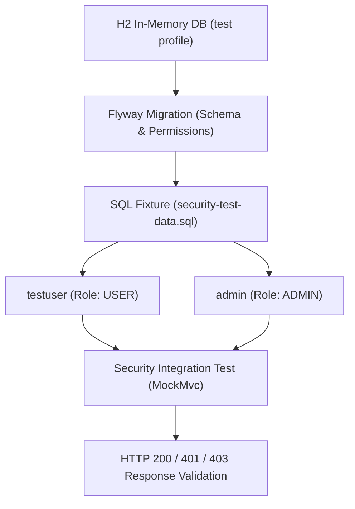
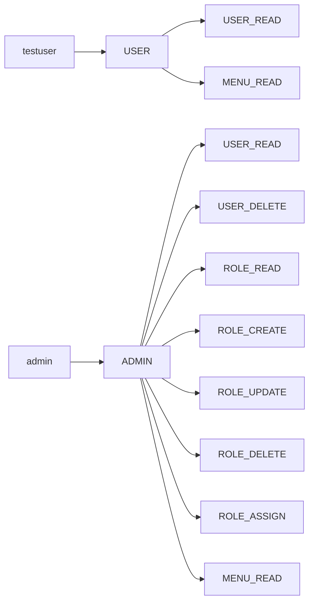

# [Testing] 보안 및 RBAC 통합 테스트 명세와 결과 (Security Test Specification & Results)

- **Version:** 1.0.0
- **Last Updated:** 2026-08-26
- **Status:** Active
- **Applied Tech Stack:** JUnit 5, Spring Boot Test, H2 In-Memory Database, MockMvc, Flyway

본 문서는 `APMS.SR` 시스템의 인증(Authentication), 인가(Authorization), RBAC(Role-Based Access Control) 권한 제어에 대한 **테스트 데이터 구성**, **테스트 케이스 매트릭스**, **실행 및 검증 결과**를 통합 기록한 문서입니다.

---

## 1. 테스트 환경 및 아키텍처 (Test Architecture)

테스트 환경은 독립성과 재현성을 보장하기 위해 `test` 프로필의 H2 인메모리 데이터베이스를 사용하며, Flyway를 통해 최신 DDL 스키마와 기본 권한 메타데이터를 초기화합니다.

### 1) 계층별 테스트 구성
| 컴포넌트 | 테스트 구성 방식 | 역할 및 검증 대상 |
| :--- | :--- | :--- |
| **Database** | H2 In-Memory (`jdbc:h2:mem:testdb`) | 테스트 격리 환경 제공 및 빠른 롤백 |
| **Schema/Meta** | Flyway (`db/migration`) | 테이블 DDL 및 표준 Role/Permission 적재 |
| **User Data** | `security-test-data.sql` | `testuser`, `admin` 계정 및 역할 매핑 |
| **Filter/Mock** | `MockMvc` + Mock `TokenBlacklistService` | Spring Security Filter Chain 및 컨트롤러 통합 검증 |

---

## 2. 테스트 데이터 명세 (Test Users & Permissions)

### 1) 테스트 사용자 계정 (Test Users)
| 계정 ID (Username) | 계정 상태 | 부여 역할 (Role) | 테스트 목적 |
| :--- | :--- | :--- | :--- |
| **`testuser`** | `ACTIVE` | `USER` | 일반 사용자 권한 범위 및 인가 거부(403) 테스트 |
| **`admin`** | `ACTIVE` | `ADMIN` | 관리자 전용 API 및 Role/Permission 관리 테스트 |

> **원칙:** 실제 운영 데이터나 개인정보는 테스트에 일절 사용하지 않으며, 비밀번호는 BCrypt 인코딩된 고정 테스트 해시를 사용합니다.

### 2) 테스트 데이터 매핑 구조

### 3) 테스트 클래스별 데이터 소스
* `PermissionIntegrationTest` / `RolePermissionIntegrationTest`: Flyway 메타데이터 기반 검증
* `RbacSecurityIntegrationTest` / `SecurityIntegrationTest`: `security-test-data.sql` + JWT MockMvc 검증
* `MenuSecurityIntegrationTest`: Spring Security `@WithMockUser` Authority 기반 단위/통합 검증
* `AuthServiceTest`: Mockito 단위 테스트 (DB Fixture 비의존)

---

## 3. 보안 테스트 매트릭스 (Security Test Matrix)

### 1) 인증 (Authentication)
| Test ID | 시나리오 (Scenario) | 기대 결과 (Expected) | 실제 검증 (Status) |
| :--- | :--- | :---: | :---: |
| **AUTH-01** | 정상 발급된 유효한 JWT Access Token으로 보호 API 접근 | `200 OK` | ✅ PASS |
| **AUTH-02** | `Authorization` 헤더가 누락된 요청 | `401 Unauthorized` | ✅ PASS |
| **AUTH-03** | 위조되거나 만료된 잘못된 JWT 서명 요청 | `401 Unauthorized` | ✅ PASS |

### 2) 인가 (Authorization)
| Test ID | 시나리오 (Scenario) | 기대 결과 (Expected) | 실제 검증 (Status) |
| :--- | :--- | :---: | :---: |
| **AUTHZ-01** | 엔드포인트에 필요한 `Authority`(Permission)를 보유한 상태 | `200 OK` | ✅ PASS |
| **AUTHZ-02** | 인증은 완료되었으나 요구 `Authority`가 없는 상태 | `403 Forbidden` | ✅ PASS |
| **AUTHZ-03** | 일반 사용자(`USER`)가 관리자 전용 URL 접근 시도 | `403 Forbidden` | ✅ PASS |

### 3) RBAC 및 역할 관리 (Role & Permission Management)
| Test ID | 시나리오 (Scenario) | 기대 결과 (Expected) | 실제 검증 (Status) |
| :--- | :--- | :---: | :---: |
| **RBAC-01** | `ADMIN` 계정의 신규 Role 생성 (`POST /api/admin/roles`) | `201 Created` | ✅ PASS |
| **RBAC-02** | `ADMIN` 계정의 Role 정보 수정 (`PUT /api/admin/roles/{id}`) | `200 OK` | ✅ PASS |
| **RBAC-03** | `ADMIN` 계정의 Role 삭제 (`DELETE /api/admin/roles/{id}`) | `200 OK` | ✅ PASS |
| **RBAC-04** | Role에 특정 Permission 신규 할당 (`POST /api/admin/roles/{id}/permissions`)| `200 OK` | ✅ PASS |
| **RBAC-05** | `ROLE_ASSIGN` 권한이 없는 계정의 권한 변경 시도 | `403 Forbidden` | ✅ PASS |

### 4) 메뉴 접근 제어 및 Negative Authorization
| Test ID | 시나리오 (Scenario) | 기대 결과 (Expected) | 실제 검증 (Status) |
| :--- | :--- | :---: | :---: |
| **NEG-01** | `USER` ➡️ `ROLE_READ` (관리자 역할 조회 API 접근) | `403 Forbidden` | ✅ PASS |
| **NEG-02** | `USER` ➡️ `ROLE_CREATE` (역할 생성 API 접근) | `403 Forbidden` | ✅ PASS |
| **NEG-03** | `USER` ➡️ `USER_DELETE` (타 사용자 삭제 API 접근) | `403 Forbidden` | ✅ PASS |
| **NEG-04** | `USER` ➡️ `MENU_READ` (일반 메뉴 조회 API 접근) | `200 OK` | ✅ PASS |
| **NEG-05** | `ADMIN` ➡️ 전체 관리자 API 접근 | `200 OK` | ✅ PASS |
| **NEG-06** | 미인증 사용자 ➡️ `/api/menus` 및 보호 API 접근 | `401 Unauthorized` | ✅ PASS |

---

## 4. 테스트 실행 결과 요약 (Execution Summary)

| 카테고리 | 검증 방식 | 실행 결과 | 비고 |
| :--- | :--- | :---: | :--- |
| **Authentication Flow** | Integration Test (MockMvc) | **PASS** | `SEC-AUTH-01 ~ 03` 전체 통과 |
| **Authorization & 403** | Integration Test (MockMvc) | **PASS** | `@PreAuthorize` 권한 차단 검증 완료 |
| **Role/Permission CRUD** | Integration Test | **PASS** | 다대다 매핑 및 영속성 전이 검증 |
| **Refresh Token Rotation** | Code Implementation | **Verified** | 런타임 Redis 연계 추가 검증 필요 |
| **Access Token Blacklist**| Code Implementation | **Verified** | Mock 서비스 기반 단위 테스트 완료 |
| **Redis Failure Handling**| Architecture Review | **Verified** | 장애 주입(Chaos) 런타임 테스트 필요 |

---

## 5. 한계점 및 향후 개선 계획 (Limitations & Next Steps)

1. **Redis 런타임 연계 테스트:**
   - 현재 Spring Boot 통합 테스트에서는 빌드 속도 및 환경 독립성을 위해 `TokenBlacklistService`를 Mocking 처리함.
   - 추후 Testcontainers 기반의 실제 Redis 컨테이너를 구동하여 TTL 자동 만료 및 Blacklist 조회 통합 테스트를 보강할 예정.
2. **장애 내구성 테스트:**
   - Redis 인스턴스 다운 시 Spring Security 필터에서 발생하는 `RedisUnavailableException` 예외가 503 상태 코드로 안전하게 변환되는지 E2E 부하 테스트를 병행할 예정.
